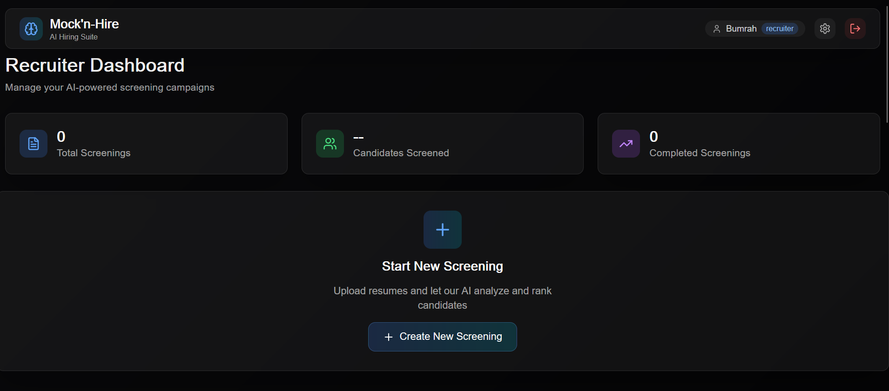
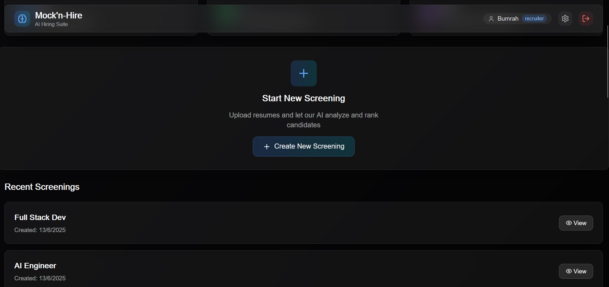

# Mock'n-Hire: An AI-Powered Hiring Suite

[](https://16icccnt.com/)

[cite_start]**Mock'n-Hire** is a comprehensive AI framework designed to streamline the modern hiring process by integrating automated, semantic resume screening with real-time, emotion-aware mock interview feedback[cite: 73, 61]. [cite_start]The platform empowers recruiters with customizable, unbiased candidate ranking and equips candidates with personalized tools to improve their interview readiness[cite: 78, 96].

[cite_start]This project has been accepted for presentation at the **2025 16th International Conference on Computing Communication and Networking Technologies (ICCCNT)**[cite: 7, 414].

***

## 📸 Screenshots

Here is a look at the Mock'n-Hire platform in action.

| Recruiter Dashboard | Candidate Screening & Analysis |
| :---: | :---: |
|  |  |

***

## ✨ Key Features

* [cite_start]**AI-Powered Resume Ranking:** Utilizes advanced language models to parse resumes and rank candidates based on semantic relevance to the job description, moving beyond simple keyword matching[cite: 74, 162].
* [cite_start]**Custom Recruiter Weighting:** Allows recruiters to define the importance of different sections like **Experience, Projects, and Certifications** to tailor the screening process to specific roles[cite: 139, 164].
* [cite_start]**Personalized Mock Interviews:** Automatically generates interview questions (**Technical, HR, Situational**) based on the candidate's own resume, ensuring a relevant and effective practice session[cite: 74, 172].
* [cite_start]**Real-Time Emotion & Stress Analysis:** Employs a **MobileNetV2** deep learning model to analyze a candidate's video feed during mock interviews, providing instant, objective feedback on emotional cues and stress levels[cite: 75, 176].
* [cite_start]**Comprehensive Dashboards:** Offers intuitive interfaces for both recruiters to manage screenings and for candidates to practice interviews and review detailed performance reports[cite: 251].
* [cite_start]**High Accuracy:** The system achieves **86.4% precision** in top-10 resume selection and over **82% accuracy** in stress identification, closely mirroring the judgment of human recruiters[cite: 77, 306, 327].

***

## 🏗️ System Architecture

The platform is built on a scalable, cloud-native architecture that cleanly separates the frontend, backend, and AI models.

1.  **Resume Screening Workflow:** A recruiter uploads a batch of resumes. [cite_start]The **FastAPI** backend uses a Large Language Model (e.g., Mistral-8x7B) to parse, analyze, and score each resume against the job description and custom weights[cite: 268, 281]. The ranked list of candidates is then displayed on the recruiter's dashboard.
2.  **Mock Interview Workflow:** A candidate starts a mock interview session. [cite_start]The backend generates personalized questions based on their resume[cite: 282]. [cite_start]As the candidate records video responses, the feed is processed in real-time by a **MobileNetV2** model to detect emotions and calculate a stress score[cite: 283].
3.  [cite_start]**Data & Authentication:** All user data, resumes, job postings, and analytics are securely managed using **Supabase**, which provides the PostgreSQL database, storage, and user authentication[cite: 76, 185].

***

## 💻 Technology Stack

| Category | Technologies |
| :--- | :--- |
| **Frontend** | Next.js, React, Tailwind CSS |
| **Backend** | Python, FastAPI |
| **AI/ML** | Large Language Models (Mistral-8x7B), Sentence Transformers, MobileNetV2, TensorFlow |
| **Database & Cloud** | Supabase, PostgreSQL |

***

## 🚀 Getting Started

Follow these instructions to set up and run the project locally.

### Prerequisites

* Python 3.9+
* Node.js and npm
* Supabase account for database and authentication keys.

### Installation & Setup

1.  **Clone the repository:**
    ```bash
    git clone [https://github.com/your-username/mock-n-hire.git](https://github.com/your-username/mock-n-hire.git)
    cd mock-n-hire
    ```

2.  **Setup the Backend:**
    ```bash
    # Navigate to the server directory
    cd server

    # Create and activate a virtual environment
    python -m venv venv
    source venv/bin/activate  # On Windows, use `venv\Scripts\activate`

    # Install Python dependencies
    pip install -r requirements.txt
    ```

3.  **Setup the Frontend:**
    ```bash
    # Navigate back to the root directory
    cd ..

    # Install Node.js dependencies
    npm install
    ```

4.  **Environment Variables:**
    * Create a `.env.local` file in the root directory for the frontend and add your Supabase project URL and anon key.
    * Create a `.env` file in the `server/` directory for the backend with any necessary API keys.

### Running the Application

1.  **Start the Backend Server:**
    * From the `server/` directory, run the FastAPI application.
    ```bash
    uvicorn main:app --reload
    ```

2.  **Start the Frontend Development Server:**
    * In a new terminal, run the Next.js app from the root directory.
    ```bash
    npm run dev
    ```
    * Open your browser and navigate to `http://localhost:3000`.

***

## 📁 File Structure

Here is an overview of the key files in the project repository:
```
.
├── app/          # Core Next.js pages and routing
├── components/   # Reusable React components
├── hooks/        # Custom React hooks
├── lib/          # Helper functions and libraries
├── new_frontend/ # Additional or alternative frontend assets
├── server/       # FastAPI backend application
├── .eslintrc.json# ESLint configuration for code quality
├── .gitignore    # Git ignore file
└── README.md     # You are here!
```
***

## ✍️ Authors

This project was developed by researchers from Amrita Vishwa Vidyapeetham, India.

* **Kowshik Naidu Padala** 
* **Rahul Thota** 
* **Teja Sai Sathwik Peruri** 
* **Anjali T** 

***

## 📜 License

This project is licensed under the MIT License.
